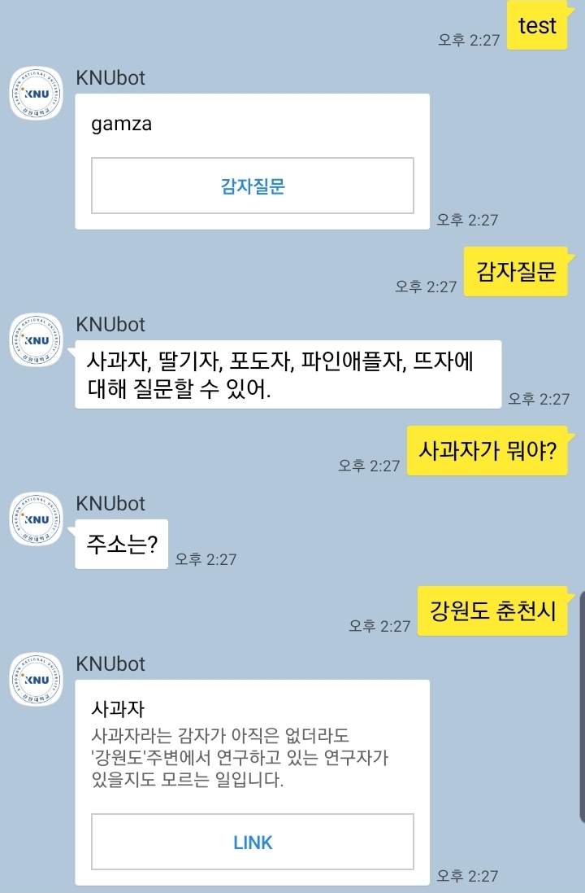

# 2019.10.21 AWS, flask 이용하여 테스트 성공
- 사용된 코드: test2.py

## 구현내용
- AWS EC2 Freetier 사용, 보안그룹 모든 액세스 허용, 탄력적 IP 할당받음
- 서버 생성 시 다운받은 aws_key 를 puttygen으로 .ppk 파일 생성
- .ppk 파일을 MobaXTerm에 키로 넣어 서버 접속&컨트롤 하였음.
- 카카오톡 채널 개설 후 스킬 생성, url에 https://IP:5000/gamza 형식으로 입력
### 폴백 블록: 유효하지 않은 입력에 gamza라는 카드로 응답함.
- 감자 설명 버튼을 누르면 "test2"블록으로 이동
### test2 블록: 감자종류와 주소를 입력받고 출력
- 주소는 카카오톡 기본 제공 엔티티 중 하나인 sys.location을 활용
## 테스트 화면

 
##reference
- https://teamlab.github.io/jekyllDecent/blog/tutorials/%EC%B9%B4%EC%B9%B4%EC%98%A4%ED%86%A1_%EC%B1%97%EB%B4%87_%EB%A7%8C%EB%93%A4%EA%B8%B0_with_python_flask_aws
- https://github.com/deepseasw/kakao_i_pizza_chatbot/blob/master/alphago_pizza.py
